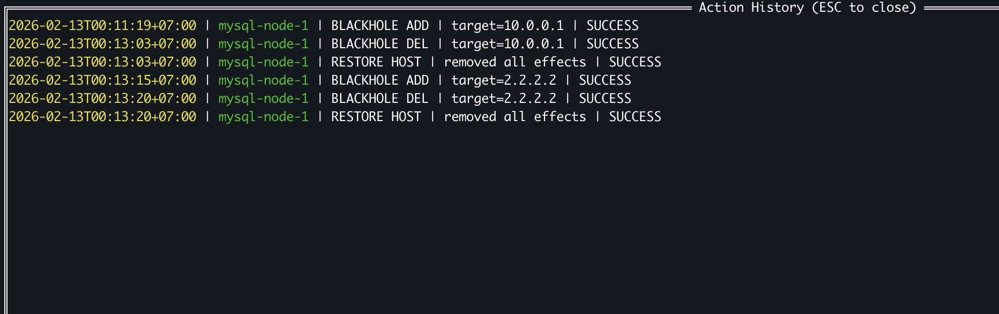

# 📖 Usage Guide

> For installation, configuration, and keyboard shortcuts, see the [README](README.md).

---

## Host View

The default view shows all hosts with their connection status and any active effects:


Each host displays:
- **Host name** and **IP address**
- **Status**: `HEALTHY` (connected + sudo OK) or `NO SUDO`
- **Active effects** inline, e.g. `(BlackHole:10.0.0.1) (BlackHole:10.0.0.2)`

When hosts have active effects applied, the host list shows tracked rules:


Use `↑`/`↓` arrow keys to navigate, then press `Enter` to open the action menu.

## Actions

Press `Enter` on a host to open the action menu:


### 1. Blackhole Routing

Drops **all traffic** to a specific IP or CIDR using `ip route add blackhole`.


- Enter a single IP (e.g. `9.9.9.9`) or CIDR (e.g. `10.0.0.0/24`)
- **Multiple IPs** supported — separate with commas: `192.168.3.21,192.168.3.22,192.168.3.23`
- Duplicate routes are detected and reported

After applying, you'll see a confirmation:


### 2. Latency Injection

Adds network delay to a specific interface using `tc qdisc`.


- **Interface** is auto-detected (if only one interface exists, selection is skipped)
- Enter delay value, e.g. `100ms`, `200ms`

### 3. Packet Loss

Simulates unreliable network by dropping random packets using `tc qdisc`.


- Enter loss percentage, e.g. `10%`, `5%`
- Applied to the selected network interface

### 4. Port Blocking

Blocks a specific TCP port from a source IP using `iptables`.

- Enter the **port number** and **source IP**
- Only TCP is supported

### 5. Restore Effects

You have multiple restore options:

**Restore All** — Removes all effects from the selected host:


**Restore Single Effect** — Pick a specific rule to remove:
```
┌─ Restore - mysql-node-1 ──────────┐
│ (1) BlackHole: 1.1.1.1            │
│ (2) BlackHole: 2.2.2.2            │
│ (3) Latency: 100ms eth0           │
│     Back                          │
└────────────────────────────────────┘
```

## Group View

Press `g` to switch to Group View. Instead of repeating the same action on every host one by one, group view lets you apply actions to **all hosts in a group** at once.

Groups are defined in the config file via the `group` field:

```yaml
hosts:
  - name: mysql-node-1
    ip: 192.168.3.11
    ssh_user: kienlt
    group: galera          # ← this host belongs to "galera" group
  - name: mysql-node-2
    ip: 192.168.3.12
    ssh_user: kienlt
    group: galera
  - name: redis-1
    ip: 192.168.3.21
    ssh_user: kienlt
    group: redis
```

Press `Enter` on a group to open the **group action menu**:

### Group Actions

**1. Blackhole (manual IPs)**
- Enter IPs/CIDRs manually (comma-separated), applied to **all hosts** in the group
- Example: blackhole `10.0.0.1,10.0.0.2` on every host in `galera` group

**2. Blackhole by Group**
- Select **another group** from a list, and blackhole all IPs of that target group
- Use case: group `k8s` wants to block all traffic to group `galera` → select `galera` and all its host IPs get blackholed on every `k8s` host
- This also works for a **single host** selecting a group to block

**3. Restore All**
- Removes all active effects for **every host** in the group at once

After applying a group action, a **summary dialog** shows results per host — including which succeeded and which failed (e.g. duplicate routes):


> [!NOTE]
> Hosts with connection issues (`NO SUDO`, disconnected) are automatically skipped during group actions.

Press `l` or `Esc` to switch back to Host View.

## Utility Features

### Host Filtering

Press `/` to open the filter dialog. Type to search hosts by name — works similar to K9s filtering.

### Protected IPs

Press `p` to view SSH source IPs for all hosts. This helps you avoid accidentally locking yourself out:


> [!WARNING]
> If you try to blackhole your own SSH source IP, lazy-hole will show a warning and ask for confirmation before applying.

### Action History

Press `h` to view the full audit log of all actions performed, with timestamps:



History is also persisted to `.lazy-hole/history.log`.

### Undo Last Action

Press `u` to undo the most recently applied effect. A confirmation dialog will appear before undoing.

### Refresh Host Status

Press `r` to reconnect SSH and refresh the status of all hosts. Useful if you've fixed sudo access or network issues.


## Auto-Restore on Exit

When you quit (`q`, `Esc`, or `Ctrl+C`), lazy-hole **automatically cleans up all active effects** on every host:

```
Cleaning up effects...
Restored 3 hosts
```

> [!IMPORTANT]
> All effects are tracked in memory. If the process is killed forcefully (e.g. `kill -9`), effects will **not** be auto-restored. In that case, you need to manually clean up on the target hosts.
