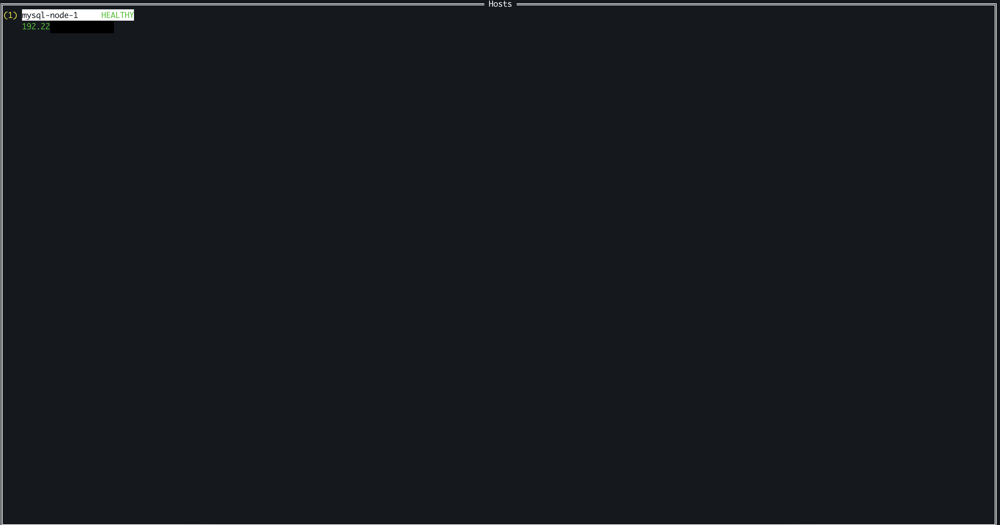

# Day 7: Feb 9,2026

# Epic 4 - Terminal UI

Goal: Interactive terminal interface using `tview`

Install it first!

### Story 4.1: Host list with status
Goal: Display hosts with status indicators.

So we have to learn tview lib syntax, need to understand it's concept first before syntax! So I'm mainly linux system admin so i will make reflection based tview concepts, purpose? ofc it is for easier imagination!

| tview | Linux equivalent |
| -------- | ------- |
| `tview.Application` | Terminal session - container everything! |
| `tview.List` | output of `ls` - list can be select |
| `SetInputCapture()` | like trap command in bash, capture signal/keyboard |
| `Run()` | Like while loop, waiting for input |
| `app.Stop()` | like exit out of loop |
| Color tags [red] | like escape codes in bash?? |

Comparison with what I already know/copied xD

| tview | project lazy-hole |
| --- | --- |
| `NewTUI()` | like NewEffectTracker() - constructor pattern |
| `TUI struct` | Like EffectTracker struct - container state |
| `(t *TUI) Run()` | Mehtod receiver pattern |
| Event loop `Run()` | like signal.Notify() - waiting for event then handle it! |

And output when test: 
```bash
go run . -c sample/live.yaml
```

Output for single host


Output for multiple fake host


`q` or `esc` to exit works!