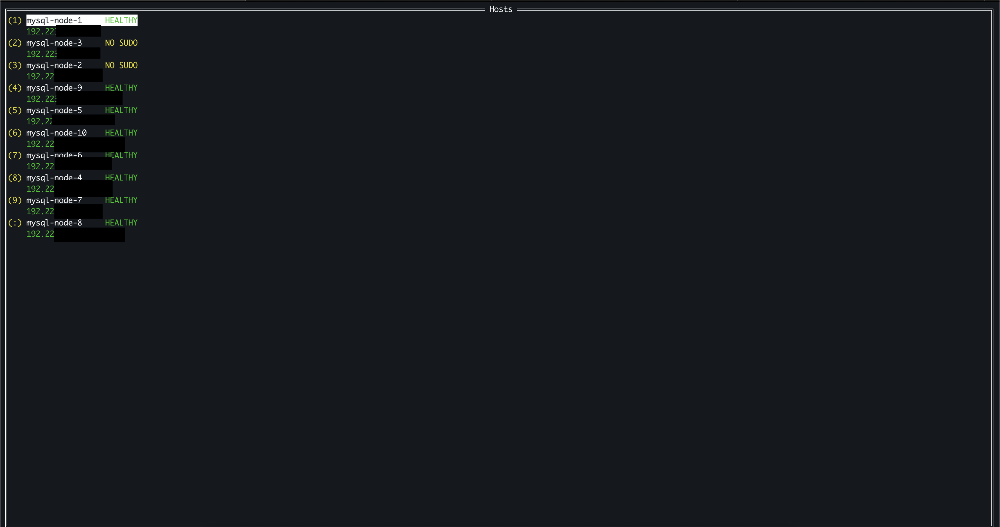
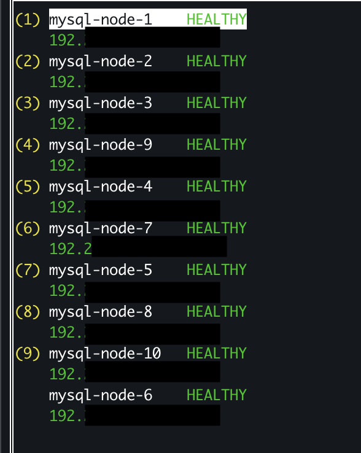
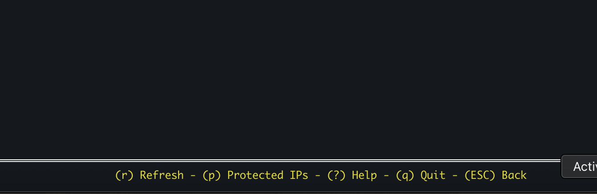
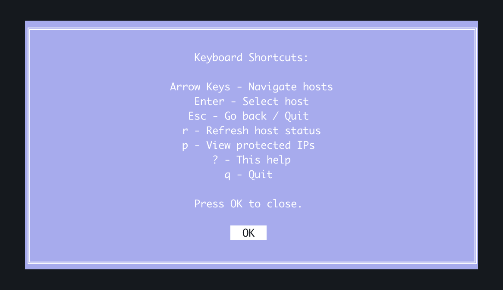
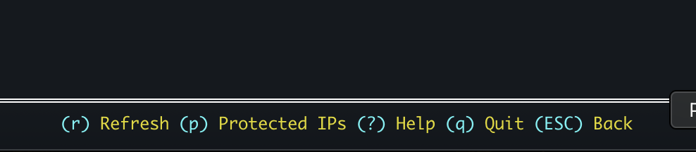
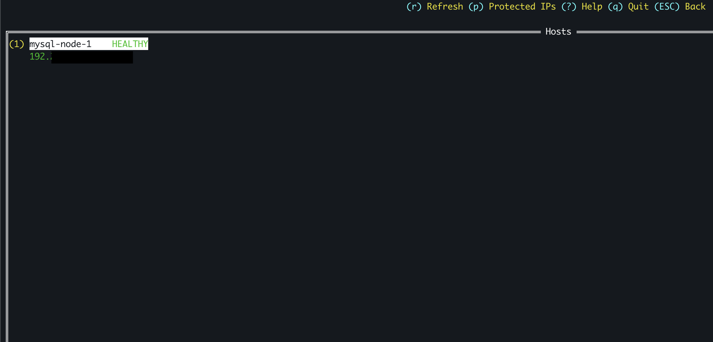
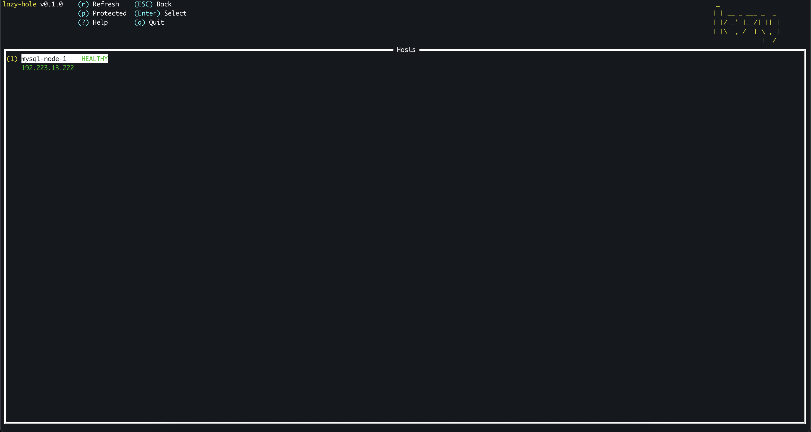

# Day 9: Feb 11, 2026

## Story 6.1: Refresh Host Status
Goal: When user press `r` in host list, refresh host status!

Test case: Add sudo for specific host without sudo, refresh to see host getting update or not.

Refresh host can lead to order of host changed, i wonder i should make it persistent like order or config file or not?


Result Before:


After hit button refresh:


And yeah, there is no guide for user know where the fuck is button r do. So we have to put that shit to 6.2

## Story 6.2: Add help overlay
Goal: When user press `?` in host list, show help overlay!

Test case: Press `?` in host list, show help overlay, press `?` again, hide help overlay.

work complete:




But i'm fan of k9s style, i think i need header section and button will be display like k9s style!

First SetDynamicColors() is must have! for dynamic color
```go
		SetText("[aqua](r)[-] Refresh [aqua](p)[-] Protected IPs [aqua](?)[-] Help [aqua](q)[-] Quit [aqua](ESC)[-] Back").
```

Will give output

it looks much better!

Ok finally update


hmm, Still not interest. I want to make it more like k9s style

- left header: version
- middle header: command list
- right header: show label like lazy. I will vibe coding at this time LOLLL

This look fun: https://patorjk.com/software/taag/#p=display&f=Small+Block&t=lazy&x=none&v=4&h=4&w=80&we=false
+1 useful tool

LGTM



## Story 6.3: Add filter for host

Holy fucking shit, I'm feeling lazy right now. Just vibe code! LOL

So Goal is add handler for key `/`. It will popup a filter with input field. User can type to filter host, and press enter to apply filter. Press escape to cancel filter.

Filter work well!

# New Feature: Block specific port on specific IP
Just vibe code, I'm lazy today bro!

Holy fucking shiet:
```
UNAVAILABLE (code 503): No capacity available for model claude-opus-4-6-thinking on the server
```

And yeah support TCP Port only, because at this time I never use any scenario that need block UDP!

Port block need only 2 params (Port + IP), so i just add 2 params to action menu! No need to create new handler for port block

Vibe code added
- new const effect `EffectPortBlock`
- Added 2 new func for add/restore: `addPortBlock` + `removePortBlock`