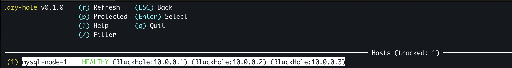
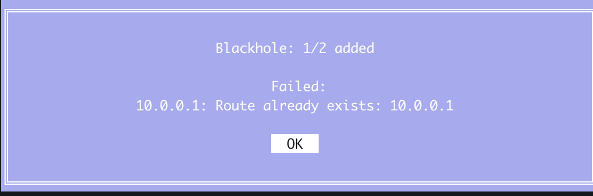

# Day 10: Feb 12, 2026

I realized input single ip into blackhole is just waste of time, i have to do it 6 times for 3 hosts (So total 18 times for input!). So i decided to add feature to support multiple ip for blackhole!

Example input for blackhole: 192.168.3.21,192.168.3.22,192.168.3.23

Logic is pretty simple to understand, right?




Before and after
```
# Before
root@kienlt-jump:~# ip r|grep black
blackhole 10.0.0.1
blackhole 10.0.0.2
blackhole 10.0.0.3
# After
root@kienlt-jump:~# ip r|grep black
```

Exists test


Ready to rock. Haha
So shit load of issue when we use it, not only for blackhole but also for others. I will fix them one by one!

And yeah, work with this shit give me a lot of questions. What is fucking different between blackhole and iptables block?
- blackhole: layer 3, drop all traffic to specific IP/CIDR
- iptables: layer 4, drop all traffic to specific port from specific IP. Hmm not really correct.
    - layer 3: `-s IP -j DROP`
    - layer 4: `-s IP -j DROP -p tcp --dport PORT` 

So literally same purpose but different layer! Haha.

So I need to make same feature for network partition like blackhole, support multi IP input. This is pretty simple to understand so I will ask for vibe code and I will review generated code!

I just reviewed backlog v2 again, too much shit and useless. Better focus on what I feel it is needed xD. So next feature is Audit log

# Feature: Audit Log
Goal: Show what user have been done with date time! and could be add new hotkey `h` for history inside TUI as well xD

Hmm, no idea why I forgot why I use Mutex already. Holy fucking shiet

Mutex = Mutual Exclusion: Only 1 goroutine allowed at 1 section at same time

Case EffectTracker: TUI run in main goroutine, but restoreAll() func cleanup run in it's own goroutine (in funcking setupCleanUp func - signal hanndler for Ctrl +C), so if I don't use mutex, it will cause race condition! Holy fucking shiet Because Map in Go is not thread-safe - concurrent read/write can led to crash!

Case ActionLogger: Same, in scenario that I could apply action both in host A (goroutine 1) and host B (goroutine 2) at the fucking same time. No lock -> file could be corrupt or break format! 

Conclusion: if you have `shared state` + have `multiple goroutines` --> Need mutex!

again, we use method receiver in `func (l *ActionLogger)`. Oh it is fucking method. LOLL
So, "again and again".
```go
// normal func, not belong to anyone
func Log(hostname string) {....}

// Method - belong to ActionLogger
func (l *ActionLogger) Log(hostname string) {....}

// So we can call like method, this is how we use method receiver 
actionLogger.Log("hostname-here")
```

And yeah, no idea why i'm lazy like this. Vibe code then bro!