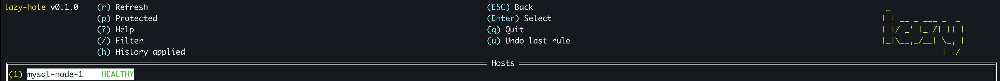
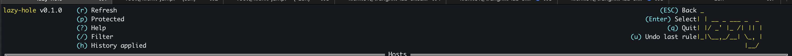

# Day 11: Feb 13, 2026

# Undo action
Goal: for easier life, support only 1 last action!

So little different to init

```go
// This need to init, because it will create new make, without init it will be nil --> panic
var effectTracker = NewEffectTracker()

// UndoStack
// No need constructor because inside it has only sync.Mutex + slice []UndoAction
// both 2 zero value can be use
// Mutex default unlocked
// Slice default nil
// So we don't need constructor, got it?
var undoStack = &UndoStack{}
```

Ok, why pointer? because method receiver is `(s *UndoStack)` - pointer receiver!. If `undoStack` is not pointer we will call `undoStack.Push()` will modify the fucking copy, not modify the original, got it?

And about `&UndoStack{}` is really confused me. I know it is related to the way how we define and called pointer. But not really complete understand like constructor example above. Holy fucking shit.

Alright, that is the fucking hardest part. Oh no, another shit going downn. Took me a while to figure out why Gemini generate 2 func `Peek` and `Pop`, normally when i write someshit related to CLI, not really need to have 2 func. I asked again and get explain: It is related to `tview async` not related to logic.

So `Peek()` is used to get last action, but not remove it from stack. `Pop()` is used to get last action and remove it from stack. Why need both, because `Peek()` get info but keep stack (no idea user yes/no) while `Pop()` remove it from stack (user confirm yes). That is why we need 2 separated func!

Summary 3 methods: `Push, Pop, Peek`
- `Push()`: User add effect success -> add action into stack
- `Peek()`: When user hit `u`, Look at `UndoAction` struct but not delete, for display pop up, "Undo this"?
- `Pop()`: User confirm yes -> remove last action from stack --> return it --> call removeSingleEffect() with it.

# Update UI
Last header was ugly, I need to update it. Here is the result



New lession learned. SetBorder(true) will eat 2 lines.
Both column use this method `SetTextAlign(tview.AlignLeft)`, it will append. You can imagine by this
```
COLUMN1 COLUMN2 =====spacehere========
```

if i set 1 column AlightLeft and 1 Alight Right



# Time to resolve pain point after little usage
- I have to repeat action add blackhole 3 times! (for 3 hosts)
- I need to grouping hosts into 1 group, and apply action for all hosts in that group!
- And right now, I don't have that much host to test (lower than 10 hosts). So there is no scenario like 1 host belong to multiple group. So this will be config format
```yaml
hosts:
  - name: mysql-node-1
    ip: 10.0.0.1
    group: galera
```

In future if I need that feature, config will be
```yaml
hosts:
  - name: mysql-node-1
    ip: 10.0.0.1
    ssh_user: kienlt
  - name: mysql-node-2
    ip: 10.0.0.2
    ssh_user: kienlt
  - name: redis-1
    ip: 10.0.0.3
    ssh_user: kienlt
groups:                    # NEW - optional section
  galera:
    - mysql-node-1
    - mysql-node-2
  redis:
    - redis-1
```

So shortkey will be `g` for switch to group view and `l` for host lists view!

And yeah, a lot of fucking thing to do to implement this shit!

First we need to update our TUI struct for sure. `viewMode` for switch, `groupList *tview.List` for group view

We need to buildGroupList() also, collect groups from statuses, build list widget!

update `buildLayout()` to include group list and switch between group/host view!

`switchToGroupView()` : set mode + build + display

`showGroupActionMenu()`: menu actions for group (like `showActionMenu()` for hosts)

`showGroupInputForm()`: form to enter params by action type

`applyGroupAction()`: loop hosts, skip bad ones, apply and show summary!

And seem like little duplicate, but merge them would caused a lot of fucking `if isGroup` conditions. Hard to read hard to maintain, right? So this is trade off and I choosed it.

DRY is great but wrong abstraction worse more than duplication.

Ok new issue, after i'm typing one by one line. I see issue that "blackhole", "partition" are not support multiple ip separated by comma.

Ok, as we know network partition is not needed and duplicate as far as I know. So we can remove it? no just comment it xD

# Refactor time for tui.go
holy fucking shiet, time to refactor, simple create new file and move function to there, since they are all in main package, no problem at all!!!

`tui.go` Core: TUI struct, NewTUI, Run, buildLayout, setupHostListKeys, formatHostLabel, showMessage, showConfirmDialog

`tui_host.go` Host view: showActionMenu, showInputForm, refreshHostList, refreshHostStatus, showRestoreMenu

`tui_group.go` Group view: buildGroupList, switchToGroupView, showGroupActionMenu, showGroupInputForm, applyGroupAction

`tui_overlays.go` Popups/dialogs: showHelp, showFilterDialog, showHistory, showUndoConfirm, showProtectedIPs

# Remove iptables partition.
removed because blackhole covers most cases.
ip route blackhole block both input/output
iptables -A input -j DROP/Reject only block traffic from Host A --> Host B, but host B traffics still allowed to host A from what I understand.

# I realized some hotkey doesn't work in group view
Hmm, seem like issue of `tview` there is no fucking concept middleware or chain handler?. Each widget need it's own handler.

# More bug
Cleanup doesn't work after refresh. PoC
```
cat .lazy-hole/history.log
2026-02-13T16:35:32+07:00 | mysql-galera-1 | BLACKHOLE ADD | target=192.168.3.11 | SUCCESS
2026-02-13T16:35:32+07:00 | mysql-galera-1 | BLACKHOLE ADD | target=192.168.3.12 | SUCCESS
2026-02-13T16:35:32+07:00 | mysql-galera-1 | BLACKHOLE ADD | target=192.168.3.13 | SUCCESS
2026-02-13T16:35:32+07:00 | mysql-galera-2 | BLACKHOLE ADD | target=192.168.3.11 | SUCCESS
2026-02-13T16:35:32+07:00 | mysql-galera-2 | BLACKHOLE ADD | target=192.168.3.12 | SUCCESS
2026-02-13T16:35:32+07:00 | mysql-galera-2 | BLACKHOLE ADD | target=192.168.3.13 | SUCCESS
2026-02-13T16:35:32+07:00 | mysql-galera-3 | BLACKHOLE ADD | target=192.168.3.11 | SUCCESS
2026-02-13T16:35:32+07:00 | mysql-galera-3 | BLACKHOLE ADD | target=192.168.3.12 | SUCCESS
2026-02-13T16:35:32+07:00 | mysql-galera-3 | BLACKHOLE ADD | target=192.168.3.13 | SUCCESS
2026-02-13T16:43:34+07:00 | mysql-galera-2 | RESTORE HOST | removed all effects | SUCCESS
2026-02-13T16:43:34+07:00 | mysql-galera-3 | RESTORE HOST | removed all effects | SUCCESS
2026-02-13T16:43:34+07:00 | mysql-galera-1 | RESTORE HOST | removed all effects | SUCCESS
```

in root_cmd.go
```go
restoreAll(statuses)  // ← use statuses from beginning!
```

But when user refresh in TUI that used func `refreshHostStatus()`, it calls
```go
// Close old client
s.Client.Close()
// create new connections
// Re-connect
t.statuses = testallHosts(hosts)
```
Simple solution: instead use connections old `statuses` , we should use `t.statuses` directly!

# Today is productive day. LOL
Implement blackhole by group:
Goal: i have 2 group k8s and mysql-db. I want blackhole all mysql-db to group k8s or single host can block whole group also!

group k8s --> action menu:
  blackhole (enter ip manually) <-- Present
  blackhole by group (select group) <-- New

And yeah, remember that shit: in `tview` `[%s]` will not work! You need to change or escape it. I choosed change to `<%s>`