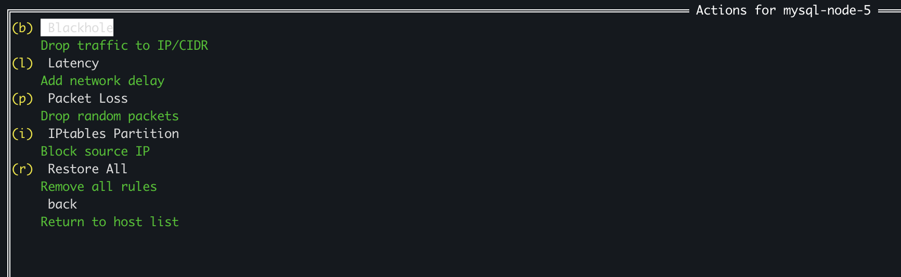
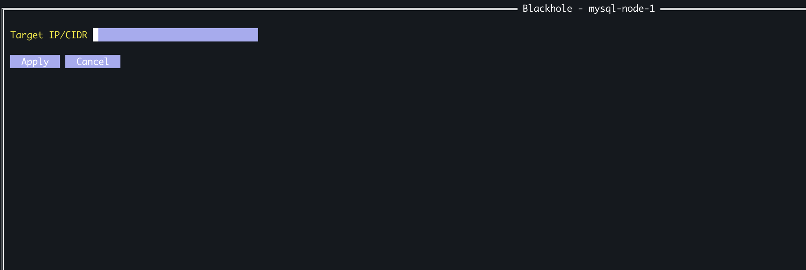
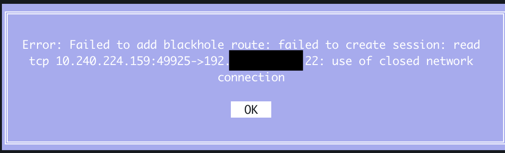
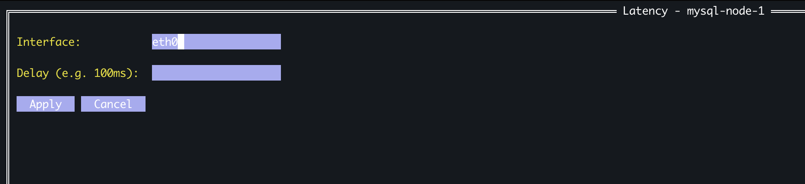
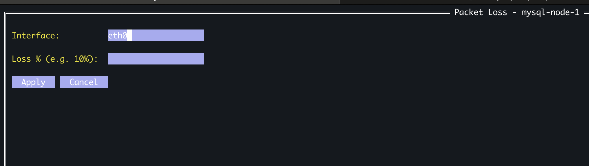
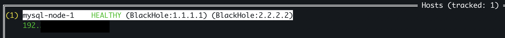
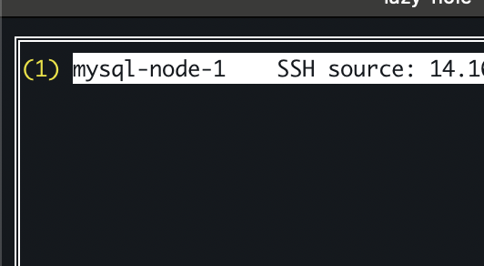

# Day 8: Feb 10, 2026

# Epic 4 - Terminal UI

## Story 4.2: Action menu for selected host
Goal: When user select host and press `enter`, show manu actions!

Closure issue, that happened in day3 but I don't understand, I will try again in day 8.

We had, example: `hosts = [hostA, hostB, hostC]`

Problem
```go
for i, status := range t.statuses {
    t.hostList.AddItem(..., func() {
        t.showActionMenu(status)   // ← false here!
    })
}
```

In loop, Go doesn't create new variable `status` each iteration, it just reuse the same variable and change value inside that.

Each func (closure) that you created, it will remember address of variable, hostC everytime --> wrong

So solution here is copy value of `status` to new variable `s`, then pass it to func.

But this is fixed in go 1.22++, not worth for remember but good to know Go was had a such as bug!

So output of this story:


## Story 4.4: Parameter input for actions
Need to do this before story 4.3!

Goal: Apply rules from TUI for real.

New concept:
- `tview.NewForm()` : Form with input field, like HTML form
- `AddInputField()`: Add field for text input
- `AddButton()`: Add button, like HTML button
- `GetFormItem(0)`: Get field by index
- `.*tview.InputField`: Type assertion, convert interface to struct??? No idea about this. Maybe convert interface to struct



Result, hmmm? 


Let's find out..
in root_cmd.go, we have define for that close
```go

					// Close connection here
					// status.Client.Close() // Temp comment for Story 4.4
				} else {
					fmt.Printf("%s: Sudo access NOT OK!\n", status.Host.User)
				}
			} else {
				fmt.Printf("%s: Failed. Issue %v\n", status.Host.Name, status.Error)
			}
```

After comment it
.

And show other form we just added

Latency:


Packet Loss:


Test restore all
Before:
```bash
root@kienlt-jump:~# ip route|grep black
blackhole 99.99.99.99
```


After:
```bash
root@kienlt-jump:~# ip route|grep black
root@kienlt-jump:~#
```

Exit and clean all effect Rule works well. They are tracked in memory.


## Bug

Fucking issue. Don't ever used `[...]` in text field of AddItem in tview!

New issue: After add rule, no rule displayed in list!

Ok, never use `fmt.Printf`, it will break TUI!

Holy fucking shiet, now shit load of bug appear. Forgot about story 4.3, fix the fucking bug first!

### Bug 1: Hidden text
Root cause: `[white]` this fucking color tag ate the fucking text
Fix: use fucking `[-]` instead of `[white]`

### Bug 2: ESC key create fucking trash
Root cause: func `Clear()` in tracker.go doesn't clean well
Fix: Just create fucking new `tview.NewList()`

### Bug 3: `fmt.Printf` break TUI
Fix: Just don't use fucking fmt in tview!

### Bug 4: Holy fucking shiet about rune (ASCII math!!!)
i=0 → '1'+0 = '1' (ASCII 49) → (1)
i=1 → '1'+1 = '2' (ASCII 50) → (2)
i=2 → '1'+2 = '3' (ASCII 51) → (3)
...
i=9 → '1'+9 = ASCII 58 = ':' → (:) 💀

Temp solution, remove short cut if number of host > 9

## Story 4.5: Continue after bug fixes. Display active rules per host
Goal: display detail rules per host
Example: 
```
mysql-node-1    HEALTHY  (BlackHole:1.1.1.1) (BlackHole:2.2.2.2)
mysql-node-5    HEALTHY  (LATENCY:100ms eth0)
```

Output


AGAIN. NEVER USE `[]` in `tview`!

## Story 4.6: Restore single effect
Goal: Restore single effect instead of all. List all rule then let user pick which to remove!

Example:
```
┌─ Restore - mysql-node-1 ─────────┐
│ (1) BlackHole: 1.1.1.1           │
│ (2) BlackHole: 2.2.2.2           │
│ (3) Latency: 100ms eth0          │
│     Back                         │
└──────────────────────────────────┘
```

Nothing much to explain, build menu with those effects. Remove when selected! Added function helper `removeSingleEffect` to do it.

# Fix missing issue from backlog for V1

## Story 5.1 - Detect SSH source IP (prevent self-lock!)

Flow
```
SSH connect → detectSSHSourceIP() → lưu vào HostStatus.SourceIP
    ↓
User select Blackhole/Partition → enter IP
    ↓
Check: target == SourceIP?
    ├── NO → apply
    └── YES → WARNING modal → confirm then apply
```

## Story 4.6 - Quit with warning!
Goal: when user press `q/ESC`, if rules active, ask quit anyway?

Added both in run and refresh host list func!!

## Implement list interface integration
Instead of manually enter interface, let user select it!

If only 1 interface return from listInterfaces func, skip fucking dropdown!

And SetAcceptanceFunc() doesn't allow it edit! Hmm, not really, it doesn't block Backspace/Delete, it is other specific fucking events

## Story 5.3: View protected IPs
Goal: press `p` in host list --> list all protected IPs to prevent self-lock!

Display what?
```
┌─ Protected IPs ──────────────────────────┐
│ mysql-node-1   SSH source: 192.168.1.100 │
│ mysql-node-5   SSH source: 192.168.1.100 │
│ mysql-node-6   SSH source: 10.0.0.1      │
│                                          │
│ Press ESC to close                       │
└──────────────────────────────────────────┘
```

Result LGTM
